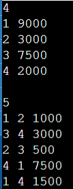

# Banking-system-simulator

## Introduction

Transaction Manager is a C++ program designed to simulate basic financial transactions between user accounts. It allows users to manage accounts, perform balance transfers, and sort account information based on balance. This project demonstrates fundamental programming concepts such as data structures, sorting algorithms, and custom comparison functions.

## Description

The program performs the following tasks:

1. **Manage Accounts:** Reads user data including IDs and initial balances.
2. **Process Transactions:** Executes a series of fund transfers between accounts, ensuring that the sender has sufficient funds.
3. **Display Transaction Status:** Outputs "Success" or "Failure" for each transaction based on its validity.
4. **Sort and Display Accounts:** After processing all transactions, sorts and displays the accounts by their balance. If balances are equal, it sorts by user ID.

## Features

- **Account Creation:** Initialize accounts with unique IDs and balances.
- **Transaction Handling:** Transfer funds between accounts and validate transactions.
- **Result Output:** Show transaction success or failure status.
- **Sorting:** Sort accounts by balance, with tie-breaking based on user ID.

3. **Input Format:**
   - First, enter the number of accounts `n`.
   - Followed by `n` lines of account data (ID and balance).
   - Enter the number of transactions `t`.
   - Followed by `t` lines of transactions (from ID, to ID, and amount).

4. **Output:**
   - The program outputs the result of each transaction ("Success" or "Failure").
   - After processing transactions, it outputs the sorted account details.

## Conclusion

The Transaction Manager program provides a foundational example of handling user accounts and transactions in C++. It highlights key concepts such as data manipulation, transaction validation, and sorting. This project can be expanded or integrated into more complex financial systems.

## output

